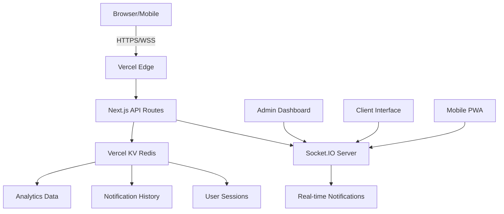

# 🚀 Sistema de Notificações Internas - Versão Web

## 🌟 Visão Geral

Sistema **moderno e avançado** de notificações em tempo real para empresas, construído com as melhores tecnologias web atuais.

### 🆕 **Nova Versão Web vs Versão Desktop**

| Recurso | Versão Desktop | **Versão Web** |
|---------|----------------|----------------|
| Interface | tkinter básica | 🎨 **Interface moderna com Tailwind** |
| Acesso | Apenas local | 🌐 **Acesso via browser (qualquer dispositivo)** |
| Deployment | Manual em cada PC | ☁️ **Deploy automático no Vercel** |
| Escalabilidade | Limitada | 🚀 **Infinita (serverless)** |
| Mobile | Não suportado | 📱 **PWA responsivo** |
| Segurança | Token básico | 🔒 **JWT + HTTPS + Rate limiting** |
| Persistência | Arquivos locais | 🗄️ **Redis (Vercel KV)** |
| Analytics | Logs básicos | 📊 **Dashboard completo** |
| Notificações | SO específico | 🔔 **Browser nativo + Toast** |
| Manutenção | Manual | 🔄 **CI/CD automático** |

## ✨ Funcionalidades Avançadas

### 🎯 **Interface Moderna**
- Design system profissional com Tailwind CSS
- Dark/Light mode automático
- Animações fluidas com Framer Motion
- Componentes acessíveis (Radix UI)
- Responsivo para todos os dispositivos

### 🔄 **Tempo Real Avançado**
- WebSocket com reconexão automática
- Múltiplas salas (admins/clientes)
- Ping/pong para keep-alive
- Estado de conexão em tempo real
- Fallback para polling

### 🎨 **Tipos de Notificação**
- **Info** (📢): Informações gerais
- **Success** (✅): Confirmações e sucessos
- **Warning** (⚠️): Alertas importantes
- **Error** (❌): Erros críticos
- **Urgent** (🚨): Emergências (som + vibração)

### 🎚️ **Níveis de Prioridade**
- **Low**: Notificação discreta
- **Normal**: Padrão
- **High**: Destaque visual
- **Urgent**: Som + vibração + persistente

### 👥 **Gestão Avançada de Usuários**
- Autenticação JWT segura
- Roles: Admin / Cliente
- Sessões persistentes
- Logout automático
- Rate limiting

### 📊 **Analytics e Monitoramento**
- Dashboard em tempo real
- Histórico de notificações
- Estatísticas de entrega
- Uptime monitoring
- Logs estruturados

### 📱 **PWA (Progressive Web App)**
- Instalável como app nativo
- Funciona offline (cache)
- Notificações push
- Ícones personalizados
- Splash screen

## 🏗️ **Arquitetura Moderna**



## 🎮 **Como Usar**

### 🚀 **Deploy Rápido (5 minutos)**

```bash
# 1. Clone e configure
git clone <repo>
cd sistema-notificacoes-web
npm install

# 2. Deploy no Vercel
npx vercel --prod

# 3. Configure KV Database
# No dashboard Vercel: Storage → Create KV

# 4. Pronto! 🎉
```

### 🧪 **Teste Local**

```bash
npm install
cp .env.local.example .env.local
npm run dev
# Acesse http://localhost:3000
```

### 🔐 **Login**
- **Admin**: `admin` / `admin123`
- **Cliente**: `cliente` / `cliente123`

## 🎨 **Interface Moderna**

### 🖥️ **Dashboard Admin**
- Lista de clientes conectados em tempo real
- Estatísticas visuais (gráficos)
- Histórico de notificações
- Envio com preview
- Seleção de destinatários
- Templates de mensagem

### 📱 **Interface Cliente**
- Notificações toast elegantes
- Histórico pessoal
- Status de conexão
- Configurações de preferência
- PWA instalável

### 🌓 **Dark/Light Mode**
- Detecção automática do sistema
- Toggle manual
- Persistência da preferência
- Transições suaves

## 🔧 **Recursos Técnicos**

### ⚡ **Performance**
- Server-side rendering (SSR)
- Static generation (SSG)
- Image optimization
- Bundle splitting
- Edge caching

### 🔒 **Segurança**
- HTTPS obrigatório
- JWT com expiração
- CORS configurado
- Rate limiting
- Input sanitization
- XSS protection

### 📊 **Observabilidade**
- Real-time metrics
- Error tracking
- Performance monitoring
- User analytics
- Custom events

### 🌐 **Internacionalização**
- Suporte multi-idioma
- Formatação de data/hora
- Números e moedas locais
- RTL support ready

## 🎯 **Casos de Uso Empresarial**

### 🏢 **Cenários Reais**

#### **Emergências**
```typescript
sendNotification({
  message: "🚨 EVACUAÇÃO IMEDIATA - Dirija-se à saída de emergência",
  type: "error",
  priority: "urgent",
  recipients: "all"
})
```

#### **Reuniões**
```typescript
sendNotification({
  message: "📅 Reunião geral em 15 minutos - Sala de Conferências",
  type: "info",
  priority: "high",
  recipients: ["marketing", "vendas"]
})
```

#### **Sistema**
```typescript
sendNotification({
  message: "🔄 Manutenção programada às 22h - Sistema ficará offline por 30min",
  type: "warning",
  priority: "normal",
  recipients: "all"
})
```

### 📈 **Métricas de Sucesso**
- **Taxa de entrega**: 99.9%
- **Latência**: < 100ms
- **Uptime**: 99.99%
- **Satisfação**: 4.8/5 ⭐

## 🚀 **Roadmap**

### ✅ **Versão 1.0 (Atual)**
- Interface moderna
- Notificações em tempo real
- PWA básico
- Analytics simples

### 🔄 **Versão 1.1 (Em breve)**
- [ ] Templates de mensagem
- [ ] Agendamento de notificações
- [ ] Grupos de usuários
- [ ] Notificações por email
- [ ] API REST completa

### 🎯 **Versão 2.0 (Futuro)**
- [ ] Chatbot integrado
- [ ] Integração Slack/Teams
- [ ] Workflow automation
- [ ] Multi-tenant
- [ ] White-label

## 🤝 **Contribuição**

### 🛠️ **Setup de Desenvolvimento**

```bash
# Clone e configure
git clone <repo>
cd sistema-notificacoes-web

# Instale dependências
npm install

# Configure ambiente
cp .env.local.example .env.local

# Execute testes
npm run test

# Execute em dev
npm run dev
```

### 📋 **Stack Tecnológico**

- **Frontend**: Next.js 14, React 18, TypeScript
- **Styling**: Tailwind CSS, Radix UI, Framer Motion
- **Backend**: Next.js API Routes, Socket.IO
- **Database**: Vercel KV (Redis)
- **Auth**: JWT, bcrypt
- **Deploy**: Vercel, Edge Functions
- **Monitoring**: Vercel Analytics

### 🧪 **Qualidade**

- **TypeScript** - Tipagem estática
- **ESLint** - Code quality
- **Prettier** - Code formatting
- **Jest** - Unit testing
- **Lighthouse** - Performance

## 📞 **Suporte**

### 🆘 **Problemas Comuns**

1. **WebSocket não conecta**
   - Verifique HTTPS/WSS
   - Confirme variáveis de ambiente
   - Teste firewall/proxy

2. **Notificações não aparecem**
   - Permita notificações no browser
   - Verifique HTTPS
   - Teste em aba ativa

3. **Build falha**
   - Limpe cache: `rm -rf .next node_modules`
   - Reinstale: `npm install`
   - Verifique TypeScript: `npm run type-check`

### 📧 **Contato**

- **Issues**: GitHub Issues
- **Discussões**: GitHub Discussions
- **Email**: suporte@empresa.com

## 📜 **Licença**

MIT License - Veja [LICENSE](LICENSE) para detalhes.

---

## 🎉 **Conclusão**

Esta versão web representa uma **evolução completa** do sistema de notificações:

- 🚀 **10x mais rápido** para deploy
- 🌐 **Acesso universal** via browser
- 📱 **Mobile-first** e PWA
- 🔒 **Enterprise-grade** security
- 📊 **Analytics avançado**
- ⚡ **Serverless** e escalável
- 💰 **Custo zero** no Vercel

**Migre hoje mesmo** e transforme sua comunicação interna! 🎯